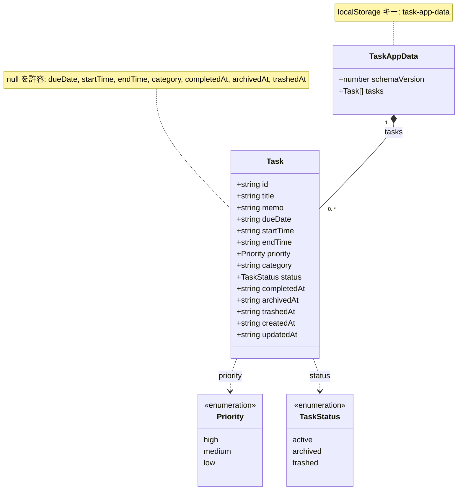

# データモデル定義書

作成日: 2026-09-07
バージョン: 0.2
対応する要件定義書: `docs/requirements.md` バージョン 0.3

## 更新履歴

| バージョン | 日付 | 内容 |
| --- | --- | --- |
| 0.1 | 2026-09-07 | 初版 |
| 0.2 | 2026-09-07 | 要件 0.3 に追随。`archivedAt` と `trashedAt` を追加。M-02、U-01からU-07 の指摘を解決済みに移動。日付変換関数の規約を追加 |

---

## 1. 設計方針

### 1.1 日付・時刻の表現をISO 8601文字列に統一する

本アプリでは、日付と時刻を**すべてISO 8601形式の文字列**で保持する。数値のタイムスタンプ（`Date.now()` の戻り値のような `number` 型）はデータとして保存しない。

この方針を採る理由は3つある。

1. 要件 5.1.4 が、日付の前後比較を `YYYY-MM-DD` の文字列比較で行うと定めている。数値タイムスタンプではこの比較ができない
2. 数値タイムスタンプはUTCの絶対時刻であり、日本時間の「本日」を求めるには必ず変換処理が必要になる。文字列であれば変換なしに比較できる
3. localStorage に保存した値を開発者が直接読んだときに、内容を判読できる

ISO 8601は粒度の異なる3つの表現を含む。本アプリはそのすべてを使い分ける。

| 用途 | 形式 | 例 | 使用フィールド |
| --- | --- | --- | --- |
| 日付のみ | `YYYY-MM-DD` | `"2026-09-10"` | `dueDate` |
| 時刻のみ | `HH:mm` | `"19:00"` | `startTime`、`endTime` |
| 日時（UTC） | `YYYY-MM-DDTHH:mm:ss.sssZ` | `"2026-09-07T10:30:00.000Z"` | `createdAt`、`updatedAt`、`completedAt`、`archivedAt`、`trashedAt` |

粒度は3種類あるが、型としてはすべて `string` であり、数値との混在はない。この意味で「統一されている」と表現する。

なお `id` の採番には `Date.now()` の戻り値を使用するが、これは識別子の材料として使うものであり、日時を表すデータではない。

### 1.2 日付フィールドと日時フィールドの使い分け

- `dueDate` は利用者が指定する**日本時間の暦の上の日付**である。時差の概念を持たない。UTCへの変換を行ってはならない
- `createdAt`、`updatedAt`、`completedAt`、`archivedAt`、`trashedAt` は**発生した瞬間の絶対時刻**である。`new Date().toISOString()` で生成し、UTCで保持する

### 1.3 日時から日本時間の日付への変換

UTC日時フィールドから日本時間の日付を取り出す処理は、要件 5.1.4 が定める次の2つの関数のみを使用する。これ以外の場所で日付への変換処理を書いてはならない。

```typescript
// UTC の ISO 8601 日時文字列を、日本時間の YYYY-MM-DD に変換する。
export function toJstDate(isoDateTime: string): string {
  return new Intl.DateTimeFormat("sv-SE", {
    timeZone: "Asia/Tokyo",
  }).format(new Date(isoDateTime));
}

// 現在時刻の日本時間の日付を YYYY-MM-DD で返す。
export function todayJst(): string {
  return toJstDate(new Date().toISOString());
}
```

`new Date()` に渡してよいのは、タイムゾーン指定を含むISO 8601日時文字列（末尾が `Z`）に限る。`new Date("2026-09-07")` のように日付のみの文字列を渡すことは禁止する。

---

## 2. 型定義

```typescript
/**
 * 優先度。要件 5.1.2 に定める3段階。
 */
export type Priority = "high" | "medium" | "low";

/**
 * タスクの状態。要件 5.1.3 に定める。
 * 「未完了」と「完了済み」の区別は status ではなく completedAt が担う。
 */
export type TaskStatus = "active" | "archived" | "trashed";

/**
 * タスク1件。
 * 予定（人との約束）も同じ型で表現し、startTime に値が入るものを予定として扱う。
 */
export interface Task {
  id: string;
  title: string;
  memo: string;
  dueDate: string | null;
  startTime: string | null;
  endTime: string | null;
  priority: Priority;
  category: string | null;
  status: TaskStatus;
  completedAt: string | null;
  archivedAt: string | null;
  trashedAt: string | null;
  createdAt: string;
  updatedAt: string;
}

/**
 * localStorage に保存する最上位の構造。
 * tasks の配列順は表示順を意味しない。表示順は要件 F-06 の規則で毎回算出する。
 */
export interface TaskAppData {
  schemaVersion: number;
  tasks: Task[];
}

/**
 * 現在のスキーマバージョン。
 * Task の構造を変更したときに 1 ずつ増やす。要件 F-14 で使用する。
 */
export const CURRENT_SCHEMA_VERSION = 1;

/**
 * localStorage のキー名。
 */
export const STORAGE_KEY = "task-app-data";

/**
 * 入力の文字数上限。要件 6.4。
 * 数え方は Array.from(str).length によるコードポイント単位とする。
 */
export const MAX_LENGTH = {
  title: 100,
  memo: 1000,
  category: 20,
} as const;

/**
 * 新規タスク作成時の初期値。要件 F-01、O-05。
 */
export const DEFAULT_TASK_VALUES = {
  memo: "",
  dueDate: null,
  startTime: null,
  endTime: null,
  priority: "medium" as Priority,
  category: null,
  status: "active" as TaskStatus,
  completedAt: null,
  archivedAt: null,
  trashedAt: null,
};
```

---

## 3. フィールド定義

### 3.1 Task

| フィールド | 型 | 必須 | 初期値 | 意味と制約 |
| --- | --- | --- | --- | --- |
| `id` | `string` | 必須 | 生成値 | タスクを一意に識別する文字列。採番方法は本書5章に従う。生成後に変更しない |
| `title` | `string` | 必須 | なし（利用者が入力） | タスク名。前後の空白を除去した後に1文字以上100文字以下。空文字を保存してはならない |
| `memo` | `string` | 必須 | `""` | 詳細説明。0文字以上1000文字以下。未入力の場合は空文字を入れる。`null` は使用しない |
| `dueDate` | `string \| null` | 任意 | `null` | 期日。`YYYY-MM-DD` 形式の日本時間の日付。未設定の場合は `null` |
| `startTime` | `string \| null` | 任意 | `null` | 開始時刻。`HH:mm` 形式の24時制。値がある場合、そのタスクは「予定」として扱われる。値がある場合は `dueDate` が必須 |
| `endTime` | `string \| null` | 任意 | `null` | 終了時刻。`HH:mm` 形式の24時制。`startTime` より後でなければならない。日をまたぐ指定はできない |
| `priority` | `Priority` | 必須 | `"medium"` | 優先度。並び替えの第2キーとして使用する |
| `category` | `string \| null` | 任意 | `null` | 分類用の文字列。自由入力。前後の空白を除去した後に1文字以上20文字以下。未入力の場合は `null` |
| `status` | `TaskStatus` | 必須 | `"active"` | 保管場所を表す |
| `completedAt` | `string \| null` | 任意 | `null` | 完了した瞬間の絶対時刻。完了を取り消すと `null` に戻す |
| `archivedAt` | `string \| null` | 任意 | `null` | アーカイブへ移動した瞬間の絶対時刻。アーカイブタブの並び順に使用する。「戻す」操作で `null` に戻す |
| `trashedAt` | `string \| null` | 任意 | `null` | ごみ箱へ移動した瞬間の絶対時刻。ごみ箱タブの並び順に使用する。「復元」操作で `null` に戻す |
| `createdAt` | `string` | 必須 | 生成時刻 | 作成した瞬間の絶対時刻。生成後に変更しない |
| `updatedAt` | `string` | 必須 | 生成時刻 | 最後に更新した瞬間の絶対時刻。任意のフィールドを変更するたびに更新する |

### 3.2 状態の組み合わせ

`status` と3つの日時フィールドの組み合わせが、要件 5.1.3 の4状態に対応する。

| 状態名 | `status` | `completedAt` | `archivedAt` | `trashedAt` | 表示先 |
| --- | --- | --- | --- | --- | --- |
| 未完了タスク | `"active"` | `null` | `null` | `null` | 「未完了」タブ |
| 完了済みタスク | `"active"` | 日時 | `null` | `null` | 「未完了」タブの末尾 |
| アーカイブ | `"archived"` | 日時 | 日時 | `null` | 「アーカイブ」タブ |
| ごみ箱 | `"trashed"` | `null` または日時 | `null` | 日時 | 「ごみ箱」タブ |

`status` と日時フィールドが上表と食い違う組み合わせは、要件上発生しない。読み込み時に検出した場合は `status` を正とし、対応する日時フィールドを補正する。

### 3.3 TaskAppData

| フィールド | 型 | 必須 | 初期値 | 意味 |
| --- | --- | --- | --- | --- |
| `schemaVersion` | `number` | 必須 | `1` | 保存データの構造バージョン。要件 F-14 のマイグレーション判定に使用する |
| `tasks` | `Task[]` | 必須 | `[]` | 全タスクの配列。アーカイブとごみ箱のタスクも同じ配列に含める。配列順は表示順を意味しない |

カテゴリの一覧を保持するフィールドは持たない。要件 F-07 の決定により、選択肢は `tasks` の `category` から重複を除いて算出する。

---

## 4. localStorage への保存

### 4.1 キー名

```
task-app-data
```

キーは1つのみ。アーカイブやごみ箱を別キーに分けることはしない。分割の要否は未決事項 O-12 とされている。

タブの選択状態とカテゴリ絞り込みの状態は保存しない（要件 6.10）。したがってUI状態用のキーは存在しない。

### 4.2 保存されるJSONの例

未完了タスク1件、完了済みタスク1件、ごみ箱のタスク1件を含む状態の例を示す。

```json
{
  "schemaVersion": 1,
  "tasks": [
    {
      "id": "1757241000000-k3f9a2",
      "title": "研究計画書を書く",
      "memo": "枝川ゼミの中間報告用。3章まで。",
      "dueDate": "2026-09-12",
      "startTime": null,
      "endTime": null,
      "priority": "high",
      "category": "研究",
      "status": "active",
      "completedAt": null,
      "archivedAt": null,
      "trashedAt": null,
      "createdAt": "2026-09-07T01:30:00.000Z",
      "updatedAt": "2026-09-07T01:30:00.000Z"
    },
    {
      "id": "1757241500000-p7x1c4",
      "title": "夕食の約束",
      "memo": "",
      "dueDate": "2026-09-10",
      "startTime": "19:00",
      "endTime": "21:00",
      "priority": "medium",
      "category": "私用",
      "status": "active",
      "completedAt": "2026-09-07T04:15:00.000Z",
      "archivedAt": null,
      "trashedAt": null,
      "createdAt": "2026-09-07T01:38:20.000Z",
      "updatedAt": "2026-09-07T04:15:00.000Z"
    },
    {
      "id": "1757240100000-m2b8e1",
      "title": "使わなくなったタスク",
      "memo": "",
      "dueDate": null,
      "startTime": null,
      "endTime": null,
      "priority": "low",
      "category": null,
      "status": "trashed",
      "completedAt": null,
      "archivedAt": null,
      "trashedAt": "2026-09-07T03:02:11.000Z",
      "createdAt": "2026-09-06T22:15:00.000Z",
      "updatedAt": "2026-09-07T03:02:11.000Z"
    }
  ]
}
```

### 4.3 保存と読み込みの規則

- 書き込みは全件を `JSON.stringify` して単一キーに保存する。差分更新は行わない
- 書き込みには500ミリ秒のデバウンスをかける（要件 6.5）
- 読み込み時にJSONの解析に失敗した場合、データを書き換えずエラー画面を表示する（要件 F-13）
- `schemaVersion` が現在値より小さい場合はマイグレーションを行い、大きい場合は読み込みを中止する（要件 F-14）

---

## 5. IDの採番方法

要件 6.8 により、`crypto.randomUUID()` は使用しない。セキュアコンテキスト（HTTPSまたはlocalhost）でのみ動作するため、開発中に実機を `http://192.168.x.x:3000` で開いた場合に例外が発生するためである。

代わりに次の方法で生成する。

```typescript
export function generateId(): string {
  const timestamp = Date.now();
  const random = Math.random().toString(36).slice(2, 8);
  return `${timestamp}-${random}`;
}
```

生成例: `1757241000000-k3f9a2`

| 項目 | 内容 |
| --- | --- |
| 構成 | ミリ秒単位のUNIX時刻と、36進数6文字の乱数をハイフンで連結する |
| 長さ | 20文字（`Date.now()` が13桁の期間） |
| 一意性 | 同一ミリ秒内に生成された場合でも、乱数部分が衝突する確率は約21億分の1 |
| 依存API | `Date.now()` と `Math.random()` のみ。セキュアコンテキストを要求しない |
| 用途の限定 | 推測が容易であるため、URLの秘匿性に依存する用途には使えない。本アプリは1人用でありデータが端末外に出ないため、問題にならない |

---

## 6. Mermaid クラス図



エンティティはTaskの1種類のみである。予定を表す独立した型は存在せず、`startTime` に値が入っているTaskを予定と呼ぶ。カテゴリは独立したエンティティを持たず、Taskの文字列フィールドとして表現する。

---

## 7. 型の使用箇所

| 型・定数 | 使用する機能 |
| --- | --- |
| `Task` | F-01からF-08、F-11、F-12のすべて |
| `Priority` | F-01（入力と初期値）、F-06（並び替えの第2キー）、F-11（プロンプト本文） |
| `TaskStatus` | F-04、F-05、F-06、F-08 |
| `TaskAppData` | F-13、F-14 |
| `CURRENT_SCHEMA_VERSION` | F-14 |
| `MAX_LENGTH` | F-01、F-02 |
| `DEFAULT_TASK_VALUES` | F-01 |
| `generateId()` | F-01 |
| `toJstDate()`、`todayJst()` | F-04、F-06 |

---

## 8. 未解決の項目

### 8.1 解釈で対応した項目

#### M-01 「日付の持ち方をどちらかに統一」という指示と、要件が定める3つの粒度

日付の持ち方をISO文字列かタイムスタンプのどちらかに統一するという指示に対し、「文字列と数値を混在させない」という意味での統一と解釈し、すべてを文字列とした。粒度の使い分けは意味の違いに基づくものであり、統合できない。`dueDate` は暦の上の日付であって絶対時刻ではないため、UTC日時に変換すると要件 5.1.4 が禁止するタイムゾーンのずれが発生する。

すべてをUTC日時に統一する案は、要件 5.1.4 と衝突するため採用していない。この解釈でよいかの確認は必要である。

### 8.2 要件側の未決事項に依存する項目

本書の内容は、要件定義書の未決事項 O-11 と O-13 の決定によって変わる可能性がある。

| 依存元 | 内容 | 本書への影響 |
| --- | --- | --- |
| O-11 | 実機が iOS の場合、音声入力が成立しない | データモデルへの影響はない。`Task` の構造は変わらない |
| O-13 | 音声入力の外部通信を許容しない場合、機能を削除する | データモデルへの影響はない。音声入力は `title` に文字列を入れるだけであり、専用のフィールドを持たないため |
| O-12 | 保存キーを分割する場合 | `STORAGE_KEY` が複数になり、`TaskAppData` の構造が変わる。分割時は `schemaVersion` を上げる |

### 8.3 解決済みの項目

バージョン 0.1 で指摘し、要件定義書 0.3 で決着した項目。

| ID | 指摘内容 | 決定 |
| --- | --- | --- |
| M-02 | `new Date()` 禁止の適用範囲が曖昧で、`completedAt` から日本時間の日付を取り出せない | タイムゾーン指定を含む日時文字列のパースを禁止対象外とし、変換関数 `toJstDate()` と `todayJst()` に処理を集約した。フィールドの追加は行わない |
| U-01 | `priority` の初期値 | `"medium"` に確定 |
| U-02 | `category` の型と文字数上限 | 自由入力とし、型は `string \| null` のまま。上限は20文字。カテゴリ一覧用のフィールドは追加しない |
| U-03 | ごみ箱とアーカイブへの移動日時を保持していない | `archivedAt` と `trashedAt` を追加 |
| U-04 | 完了を取り消すと完了日時が失われる | 仕様どおりとする。完了日時の履歴を参照する機能が存在しないため |
| U-05 | アーカイブタブとごみ箱タブの並び順が未定義 | それぞれ `archivedAt`、`trashedAt` の降順。全件表示 |
| U-06 | タブ選択状態を保存するかが未定義 | 保存しない。UI状態用の保存キーは作らない |
| U-07 | 文字数の数え方 | `Array.from(str).length` によるコードポイント単位 |
